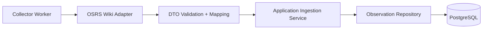
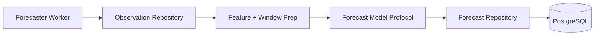
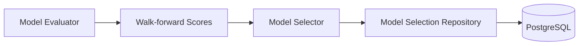

# Architecture

## Why modular monolith

A modular monolith is appropriate because:

- The project is early and local-first.
- Data ingestion, forecasting, and API access share a common model.
- Team and operational overhead of microservices is unjustified in Phase 0 and Phase 1.
- Explicit module boundaries preserve later extraction options.

## System context

- External source: OSRS Wiki Prices API.
- Core system: local API process + background workers sharing domain/application code.
- State store: PostgreSQL.

## Containers and processes

Expected containers:

- api
- collector
- postgres

Future process represented but not enabled by default profile:

- forecaster

## Layered responsibilities

- API layer: request validation, response shaping, dependency wiring.
- Application layer: orchestrates use cases, transactions, and ports.
- Domain layer: entities, value objects, invariants, forecasting contracts.
- Infrastructure layer: database repositories, HTTP adapters, model registry wiring.
- Worker layer: process entrypoints for ingestion and forecasting jobs.

## Dependency rules

- Domain depends on Python standard library only.
- Application depends on domain contracts.
- Infrastructure depends on domain + application ports.
- API depends on application and infrastructure wiring.
- No domain import of FastAPI, SQLAlchemy, httpx, or Postgres-specific modules.

## Primary runtime flows

### Collection flow

### Forecast generation flow

### Model-selection flow

## Failure handling

- External API failures are isolated per endpoint call.
- Retries only for transient conditions with bounded exponential backoff and jitter.
- Duplicate and out-of-order observations are tolerated through idempotent upsert constraints.
- Readiness endpoint reflects dependency health.

## Observability approach

- Structured logs with event name and component.
- Include IDs and counts, avoid full payload logging by default.
- Future phases may add metrics/traces.

## Scaling boundaries

- Scale reads by API replicas only after local bottlenecks are measured.
- Scale writes by tuning batch sizes and indexes first.
- Introduce partitioning for very large observation tables only when justified.
